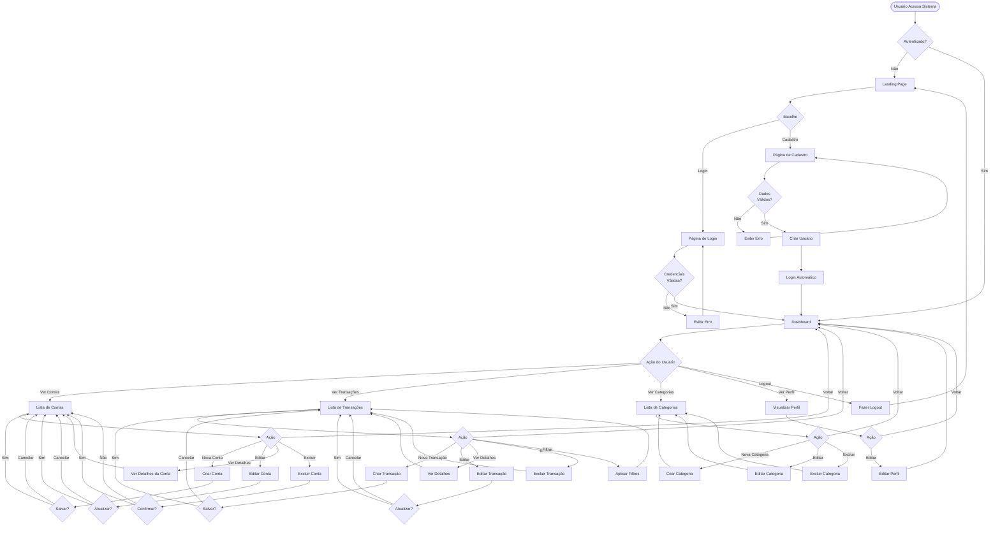
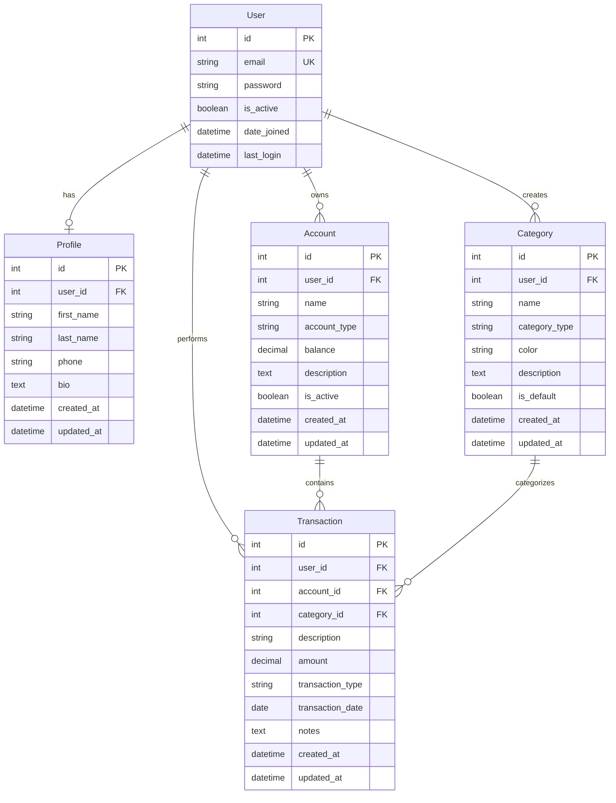
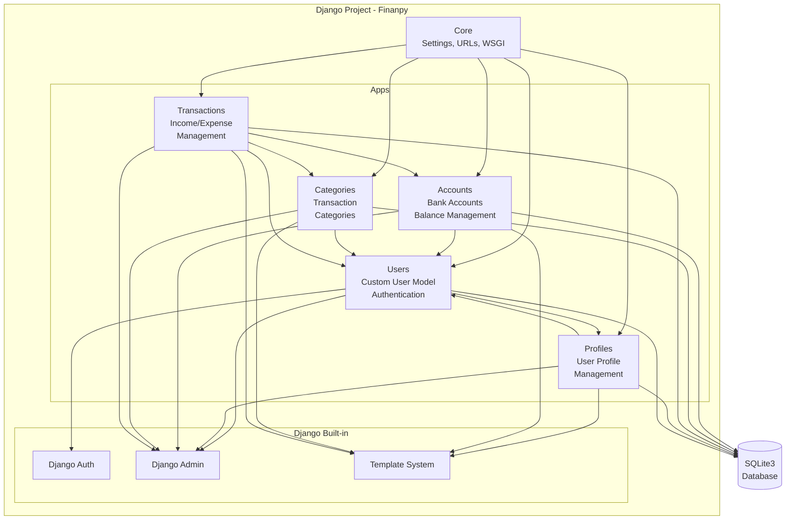

## Product Requirement Document (PRD) - Finanpy

**Versão:** 1.0  
**Data:** 25 de Outubro de 2025  
**Projeto:** Finanpy - Sistema de Gestão de Finanças Pessoais

---

## 1. Visão Geral

Finanpy é um sistema web de gestão de finanças pessoais desenvolvido em Python com Django, projetado para oferecer uma experiência moderna, intuitiva e eficiente no controle financeiro individual. O sistema permite que usuários gerenciem suas contas bancárias, categorizem transações financeiras e obtenham insights sobre seus gastos e receitas através de um dashboard interativo.

O projeto adota uma abordagem pragmática e enxuta, focando em funcionalidades essenciais sem complexidade desnecessária (evitando over-engineering). Utiliza a stack completa do Django, incluindo Django Template Language para frontend, integrado com TailwindCSS para um design responsivo e moderno com tema escuro.

---

## 2. Sobre o Produto

### 2.1 Descrição
Finanpy é uma aplicação web full-stack que centraliza o gerenciamento financeiro pessoal em uma única plataforma. O sistema oferece:

- **Gestão de Contas Bancárias**: Cadastro e controle de múltiplas contas
- **Categorização de Transações**: Organização de receitas e despesas
- **Dashboard Interativo**: Visualização consolidada da situação financeira
- **Perfil de Usuário**: Personalização e configurações individuais
- **Interface em Português**: Totalmente traduzida para o público brasileiro

### 2.2 Diferenciais
- Interface moderna com design escuro e gradientes
- Simplicidade e facilidade de uso
- Sem necessidade de instalação (web-based)
- Gratuito e de código aberto
- Arquitetura modular e escalável

---

## 3. Propósito

O propósito do Finanpy é democratizar o acesso a ferramentas de controle financeiro, oferecendo uma solução simples, moderna e eficiente para pessoas que desejam organizar suas finanças pessoais. O sistema visa:

1. **Facilitar o controle financeiro diário** através de uma interface intuitiva
2. **Promover a consciência financeira** com visualizações claras de receitas e despesas
3. **Economizar tempo** automatizando a categorização e o registro de transações
4. **Fornecer insights acionáveis** sobre padrões de gastos
5. **Ser acessível** através de qualquer dispositivo com navegador web

---

## 4. Público Alvo

### 4.1 Persona Principal
**Nome:** Maria Silva  
**Idade:** 28-45 anos  
**Ocupação:** Profissional urbano (CLT, freelancer ou empreendedor)  
**Comportamento:** 
- Busca organização financeira
- Utiliza múltiplas contas bancárias
- Quer entender melhor seus gastos
- Valoriza praticidade e design moderno
- Acessa sistemas via desktop e mobile

### 4.2 Público Secundário
- Estudantes universitários iniciando vida financeira independente
- Profissionais liberais com necessidade de controle de receitas variáveis
- Casais que desejam compartilhar o controle financeiro doméstico
- Pessoas em processo de educação financeira

### 4.3 Características do Público
- **Faixa etária:** 18-55 anos
- **Localização:** Brasil (português brasileiro)
- **Perfil tecnológico:** Intermediário a avançado
- **Necessidade:** Organização e controle financeiro pessoal

---

## 5. Objetivos

### 5.1 Objetivos de Negócio
- Lançar MVP funcional em 8-10 semanas
- Alcançar 100 usuários ativos nos primeiros 3 meses
- Manter taxa de retenção acima de 60% no primeiro trimestre
- Estabelecer base de código escalável para futuras features

### 5.2 Objetivos do Produto
- Permitir cadastro e login de usuários via email
- Possibilitar gerenciamento completo de contas bancárias
- Oferecer sistema robusto de categorização de transações
- Apresentar dashboard com visão consolidada das finanças
- Garantir responsividade em todos os dispositivos
- Manter tempo de carregamento inferior a 2 segundos

### 5.3 Objetivos dos Usuários
- Visualizar saldo atual de todas as contas em um só lugar
- Categorizar receitas e despesas de forma simples
- Entender padrões de gastos mensais
- Acessar histórico completo de transações
- Personalizar categorias conforme suas necessidades

---

## 6. Requisitos Funcionais

### 6.1 Módulo de Autenticação (Users)

#### RF001 - Cadastro de Usuário
**Descrição:** Sistema deve permitir que novos usuários se cadastrem fornecendo email e senha.

**Critérios:**
- Email único no sistema
- Senha com mínimo de 8 caracteres
- Validação de formato de email
- Confirmação de senha
- Mensagem de sucesso após cadastro

#### RF002 - Login de Usuário
**Descrição:** Usuários devem poder fazer login usando email e senha.

**Critérios:**
- Autenticação via email (não username)
- Validação de credenciais
- Mensagem de erro clara em caso de falha
- Redirecionamento para dashboard após sucesso
- Sessão persistente

#### RF003 - Logout
**Descrição:** Usuários autenticados podem fazer logout do sistema.

**Critérios:**
- Encerramento de sessão
- Redirecionamento para página inicial
- Limpeza de dados de sessão

#### RF004 - Recuperação de Senha
**Descrição:** Sistema deve permitir recuperação de senha via email.

**Critérios:**
- Envio de link de recuperação por email
- Validação de token temporário
- Formulário de nova senha
- Expiração de token após uso ou tempo limite

### 6.2 Módulo de Perfil (Profiles)

#### RF005 - Visualização de Perfil
**Descrição:** Usuário pode visualizar seus dados de perfil.

**Critérios:**
- Exibição de nome, email e informações adicionais
- Interface clara e organizada

#### RF006 - Edição de Perfil
**Descrição:** Usuário pode editar informações de seu perfil.

**Critérios:**
- Atualização de nome
- Atualização de informações adicionais
- Validação de dados
- Mensagem de confirmação

### 6.3 Módulo de Contas Bancárias (Accounts)

#### RF007 - Listagem de Contas
**Descrição:** Sistema exibe todas as contas bancárias do usuário.

**Critérios:**
- Lista ordenada de contas
- Exibição de nome, tipo e saldo
- Indicador visual de conta ativa/inativa
- Contador de transações por conta

#### RF008 - Cadastro de Conta
**Descrição:** Usuário pode cadastrar nova conta bancária.

**Critérios:**
- Nome da conta (obrigatório)
- Tipo de conta (corrente, poupança, investimento, carteira)
- Saldo inicial (opcional, padrão 0.00)
- Descrição opcional
- Validação de campos obrigatórios

#### RF009 - Edição de Conta
**Descrição:** Usuário pode editar dados de conta existente.

**Critérios:**
- Atualização de nome e descrição
- Alteração de tipo de conta
- Atualização de status (ativa/inativa)
- Validação de dados

#### RF010 - Exclusão de Conta
**Descrição:** Usuário pode excluir conta bancária.

**Critérios:**
- Confirmação antes da exclusão
- Verificação de transações vinculadas
- Mensagem de aviso se houver transações
- Soft delete preferível a hard delete

#### RF011 - Visualização de Detalhes da Conta
**Descrição:** Usuário visualiza detalhes completos de uma conta.

**Critérios:**
- Informações completas da conta
- Lista de últimas transações
- Saldo atual calculado
- Gráfico de evolução de saldo (opcional)

### 6.4 Módulo de Categorias (Categories)

#### RF012 - Listagem de Categorias
**Descrição:** Sistema exibe todas as categorias disponíveis.

**Critérios:**
- Separação entre categorias de receita e despesa
- Exibição de nome e descrição
- Indicador visual de tipo
- Contador de transações por categoria

#### RF013 - Cadastro de Categoria
**Descrição:** Usuário pode criar novas categorias.

**Critérios:**
- Nome da categoria (obrigatório)
- Tipo (receita ou despesa)
- Descrição opcional
- Cor ou ícone para identificação visual
- Validação de nome único por tipo

#### RF014 - Edição de Categoria
**Descrição:** Usuário pode editar categorias existentes.

**Critérios:**
- Atualização de nome e descrição
- Alteração de cor/ícone
- Manutenção de tipo (receita/despesa)
- Validação de dados

#### RF015 - Exclusão de Categoria
**Descrição:** Usuário pode excluir categoria.

**Critérios:**
- Confirmação antes da exclusão
- Verificação de transações vinculadas
- Opção de reatribuir transações a outra categoria
- Impedimento de exclusão se houver transações (opcional)

#### RF016 - Categorias Padrão
**Descrição:** Sistema fornece categorias pré-definidas para novos usuários.

**Critérios:**
- Criação automática ao primeiro login
- Categorias comuns brasileiras (alimentação, transporte, saúde, etc.)
- Possibilidade de edição e exclusão

### 6.5 Módulo de Transações (Transactions)

#### RF017 - Listagem de Transações
**Descrição:** Sistema exibe todas as transações do usuário.

**Critérios:**
- Lista paginada
- Ordenação por data (mais recente primeiro)
- Filtros por período, categoria, conta e tipo
- Busca por descrição
- Indicador visual de tipo (receita/despesa)

#### RF018 - Cadastro de Transação
**Descrição:** Usuário pode registrar nova transação.

**Critérios:**
- Descrição (obrigatório)
- Valor (obrigatório, positivo)
- Tipo (receita ou despesa)
- Data (obrigatório)
- Categoria (obrigatório)
- Conta bancária (obrigatório)
- Observações (opcional)
- Validação de campos
- Atualização automática de saldo da conta

#### RF019 - Edição de Transação
**Descrição:** Usuário pode editar transação existente.

**Critérios:**
- Atualização de todos os campos editáveis
- Recalculo de saldo da conta
- Validação de dados
- Registro de data de última atualização

#### RF020 - Exclusão de Transação
**Descrição:** Usuário pode excluir transação.

**Critérios:**
- Confirmação antes da exclusão
- Ajuste automático de saldo da conta
- Mensagem de confirmação

#### RF021 - Visualização de Detalhes da Transação
**Descrição:** Usuário visualiza todos os detalhes de uma transação.

**Critérios:**
- Todas as informações da transação
- Data de criação e última atualização
- Link para conta e categoria relacionadas

### 6.6 Módulo de Dashboard

#### RF022 - Dashboard Principal
**Descrição:** Página inicial após login com visão geral das finanças.

**Critérios:**
- Saldo total consolidado de todas as contas
- Resumo de receitas e despesas do mês
- Gráfico de receitas vs despesas
- Lista de últimas transações (5-10)
- Cards com estatísticas principais
- Acesso rápido às funções principais

#### RF023 - Filtros de Período
**Descrição:** Usuário pode filtrar visualizações por período.

**Critérios:**
- Filtros: Hoje, Esta semana, Este mês, Últimos 30 dias, Personalizado
- Atualização dinâmica dos dados
- Persistência de filtro selecionado

### 6.7 Módulo de Site Público

#### RF024 - Página Inicial (Landing Page)
**Descrição:** Site público apresentando o Finanpy.

**Critérios:**
- Descrição do produto
- Benefícios e features principais
- Call-to-action para cadastro
- Link para login
- Design atrativo e responsivo

#### RF025 - Página de Cadastro Público
**Descrição:** Formulário público de registro.

**Critérios:**
- Formulário de cadastro acessível
- Validação client-side e server-side
- Termos de uso (opcional para MVP)
- Redirecionamento para dashboard após sucesso

#### RF026 - Página de Login Público
**Descrição:** Formulário público de login.

**Critérios:**
- Formulário de login acessível
- Link para recuperação de senha
- Link para cadastro
- Mensagens de erro claras

### 6.8 Flowchart de UX



---

## 7. Requisitos Não-Funcionais

### 7.1 Desempenho
- **RNF001**: Tempo de carregamento de páginas inferior a 2 segundos em conexão de 10Mbps
- **RNF002**: Suporte a pelo menos 100 usuários simultâneos
- **RNF003**: Queries ao banco de dados otimizadas (máximo 10 queries por página)
- **RNF004**: Tamanho de página HTML inferior a 500KB (sem assets)

### 7.2 Segurança
- **RNF005**: Senhas armazenadas com hash (Django PBKDF2)
- **RNF006**: Proteção contra CSRF em todos os formulários
- **RNF007**: Validação de entrada em todos os campos
- **RNF008**: Proteção contra SQL Injection (uso de ORM)
- **RNF009**: HTTPS obrigatório em produção
- **RNF010**: Sessões com timeout de 2 horas de inatividade

### 7.3 Usabilidade
- **RNF011**: Interface 100% em português brasileiro
- **RNF012**: Design responsivo (mobile-first)
- **RNF013**: Feedback visual para todas as ações do usuário
- **RNF014**: Mensagens de erro claras e acionáveis
- **RNF015**: Navegação intuitiva com máximo 3 cliques para qualquer função

### 7.4 Compatibilidade
- **RNF016**: Suporte aos navegadores: Chrome 90+, Firefox 88+, Safari 14+, Edge 90+
- **RNF017**: Responsivo para resoluções de 320px a 2560px
- **RNF018**: Funcional em dispositivos touch (tablets e smartphones)

### 7.5 Confiabilidade
- **RNF019**: Backup automático do banco de dados diário
- **RNF020**: Log de erros e exceções
- **RNF021**: Tratamento gracioso de erros (sem exibição de stack traces)
- **RNF022**: Disponibilidade de 99% em produção

### 7.6 Manutenibilidade
- **RNF023**: Código seguindo PEP 8
- **RNF024**: Uso de aspas simples
- **RNF025**: Comentários em código complexo
- **RNF026**: Nomenclatura clara e descritiva em inglês
- **RNF027**: Separação de responsabilidades em apps Django distintas
- **RNF028**: Models com campos created_at e updated_at

### 7.7 Escalabilidade
- **RNF029**: Arquitetura preparada para cache (Redis futuro)
- **RNF030**: Possibilidade de migração de SQLite para PostgreSQL
- **RNF031**: Assets estáticos servidos separadamente em produção
- **RNF032**: Queries paginadas para grandes volumes de dados

---

## 8. Arquitetura Técnica

### 8.1 Stack Tecnológica

#### Backend
- **Linguagem**: Python 3.13+
- **Framework**: Django 5+
- **ORM**: Django ORM
- **Banco de Dados**: SQLite3 (padrão Django)
- **Autenticação**: Django Auth (nativo)

#### Frontend
- **Template Engine**: Django Template Language (DTL)
- **CSS Framework**: TailwindCSS
- **JavaScript**: Vanilla JS (mínimo necessário)
- **Ícones**: Heroicons ou similar

#### Ferramentas de Desenvolvimento
- **Gerenciamento de Pacotes**: pip + requirements.txt
- **Controle de Versão**: Git
- **Editor de Código**: VS Code (recomendado)
- **Linter**: flake8
- **Formatter**: black (opcional)

#### Infraestrutura
- **servidor Web**: Django Development Server (Desenvolvimento)
- **Ambiente Virtual**: venv
- **Gerenciador de Pacotes**: pip

### 8.2 Estrutura de Dados

#### Diagrama ER (Entity Relationship)



#### Detalhamento dos Models

##### User (Django Auth User - Estendido)
```python
# Utiliza django.contrib.auth.models.User
# Customização para autenticação via email
USERNAME_FIELD = 'email'
REQUIRED_FIELDS = []
```

##### Profile
```python
class Profile(models.Model):
    user = models.OneToOneField(User, on_delete=models.CASCADE)
    first_name = models.CharField(max_length=100, blank=True)
    last_name = models.CharField(max_length=100, blank=True)
    phone = models.CharField(max_length=20, blank=True)
    bio = models.TextField(blank=True)
    created_at = models.DateTimeField(auto_now_add=True)
    updated_at = models.DateTimeField(auto_now=True)
```

##### Account
```python
class Account(models.Model):
    ACCOUNT_TYPES = [
        ('checking', 'Conta Corrente'),
        ('savings', 'Poupança'),
        ('investment', 'Investimento'),
        ('wallet', 'Carteira'),
    ]
    
    user = models.ForeignKey(User, on_delete=models.CASCADE)
    name = models.CharField(max_length=100)
    account_type = models.CharField(max_length=20, choices=ACCOUNT_TYPES)
    balance = models.DecimalField(max_digits=15, decimal_places=2, default=0)
    description = models.TextField(blank=True)
    is_active = models.BooleanField(default=True)
    created_at = models.DateTimeField(auto_now_add=True)
    updated_at = models.DateTimeField(auto_now=True)
```

##### Category
```python
class Category(models.Model):
    CATEGORY_TYPES = [
        ('income', 'Receita'),
        ('expense', 'Despesa'),
    ]
    
    user = models.ForeignKey(User, on_delete=models.CASCADE)
    name = models.CharField(max_length=100)
    category_type = models.CharField(max_length=10, choices=CATEGORY_TYPES)
    color = models.CharField(max_length=7, default='#3B82F6')
    description = models.TextField(blank=True)
    is_default = models.BooleanField(default=False)
    created_at = models.DateTimeField(auto_now_add=True)
    updated_at = models.DateTimeField(auto_now=True)
```

##### Transaction
```python
class Transaction(models.Model):
    TRANSACTION_TYPES = [
        ('income', 'Receita'),
        ('expense', 'Despesa'),
    ]
    
    user = models.ForeignKey(User, on_delete=models.CASCADE)
    account = models.ForeignKey(Account, on_delete=models.CASCADE)
    category = models.ForeignKey(Category, on_delete=models.PROTECT)
    description = models.CharField(max_length=200)
    amount = models.DecimalField(max_digits=15, decimal_places=2)
    transaction_type = models.CharField(max_length=10, choices=TRANSACTION_TYPES)
    transaction_date = models.DateField()
    notes = models.TextField(blank=True)
    created_at = models.DateTimeField(auto_now_add=True)
    updated_at = models.DateTimeField(auto_now=True)
```

### 8.3 Arquitetura de Apps Django



---

## 9. Design System

### 9.1 Paleta de Cores

#### Cores Primárias
```css
/* Gradiente Principal */
--gradient-primary: linear-gradient(135deg, #667eea 0%, #764ba2 100%);
--gradient-secondary: linear-gradient(135deg, #f093fb 0%, #f5576c 100%);
--gradient-success: linear-gradient(135deg, #4facfe 0%, #00f2fe 100%);

/* Cores Sólidas */
--primary-500: #667eea;
--primary-600: #5568d3;
--primary-700: #4453b8;

--secondary-500: #764ba2;
--secondary-600: #63408a;
--secondary-700: #523672;
```

#### Cores de Fundo (Dark Theme)
```css
/* Backgrounds */
--bg-primary: #0f172a;      /* slate-900 */
--bg-secondary: #1e293b;    /* slate-800 */
--bg-tertiary: #334155;     /* slate-700 */
--bg-card: #1e293b;         /* slate-800 */

/* Borders */
--border-primary: #334155;  /* slate-700 */
--border-secondary: #475569; /* slate-600 */
```

#### Cores de Texto
```css
--text-primary: #f8fafc;    /* slate-50 */
--text-secondary: #cbd5e1;  /* slate-300 */
--text-muted: #94a3b8;      /* slate-400 */
```

#### Cores de Estado
```css
/* Success */
--success-500: #10b981;     /* green-500 */
--success-600: #059669;     /* green-600 */

/* Error */
--error-500: #ef4444;       /* red-500 */
--error-600: #dc2626;       /* red-600 */

/* Warning */
--warning-500: #f59e0b;     /* amber-500 */
--warning-600: #d97706;     /* amber-600 */

/* Info */
--info-500: #3b82f6;        /* blue-500 */
--info-600: #2563eb;        /* blue-600 */
```

### 9.2 Tipografia

```css
/* Fonte Principal */
Font Family: 'Inter', 'SF Pro Display', system-ui, -apple-system, sans-serif

/* Tamanhos */
--text-xs: 0.75rem;      /* 12px */
--text-sm: 0.875rem;     /* 14px */
--text-base: 1rem;       /* 16px */
--text-lg: 1.125rem;     /* 18px */
--text-xl: 1.25rem;      /* 20px */
--text-2xl: 1.5rem;      /* 24px */
--text-3xl: 1.875rem;    /* 30px */
--text-4xl: 2.25rem;     /* 36px */

/* Pesos */
--font-normal: 400;
--font-medium: 500;
--font-semibold: 600;
--font-bold: 700;
```

### 9.3 Componentes TailwindCSS

#### Botões
```html
<!-- Botão Primário -->
<button class="px-6 py-3 bg-gradient-to-r from-indigo-500 to-purple-600 text-white font-semibold rounded-lg shadow-lg hover:shadow-xl transform hover:-translate-y-0.5 transition-all duration-200">
    Botão Primário
</button>

<!-- Botão Secundário -->
<button class="px-6 py-3 bg-slate-700 text-slate-100 font-semibold rounded-lg border border-slate-600 hover:bg-slate-600 transition-all duration-200">
    Botão Secundário
</button>

<!-- Botão Success -->
<button class="px-6 py-3 bg-green-500 text-white font-semibold rounded-lg hover:bg-green-600 transition-all duration-200">
    Salvar
</button>

<!-- Botão Danger -->
<button class="px-6 py-3 bg-red-500 text-white font-semibold rounded-lg hover:bg-red-600 transition-all duration-200">
    Excluir
</button>

<!-- Botão Ghost -->
<button class="px-6 py-3 text-slate-300 font-semibold rounded-lg hover:bg-slate-800 transition-all duration-200">
    Cancelar
</button>
```

#### Inputs e Forms
```html
<!-- Input Text -->
<div class="mb-4">
    <label class="block text-slate-300 text-sm font-semibold mb-2">
        Nome do Campo
    </label>
    <input type="text" 
           class="w-full px-4 py-3 bg-slate-800 border border-slate-700 rounded-lg text-slate-100 placeholder-slate-500 focus:outline-none focus:ring-2 focus:ring-indigo-500 focus:border-transparent transition-all duration-200"
           placeholder="Digite aqui...">
</div>

<!-- Select -->
<div class="mb-4">
    <label class="block text-slate-300 text-sm font-semibold mb-2">
        Selecione
    </label>
    <select class="w-full px-4 py-3 bg-slate-800 border border-slate-700 rounded-lg text-slate-100 focus:outline-none focus:ring-2 focus:ring-indigo-500 focus:border-transparent transition-all duration-200">
        <option>Opção 1</option>
        <option>Opção 2</option>
    </select>
</div>

<!-- Textarea -->
<div class="mb-4">
    <label class="block text-slate-300 text-sm font-semibold mb-2">
        Descrição
    </label>
    <textarea rows="4"
              class="w-full px-4 py-3 bg-slate-800 border border-slate-700 rounded-lg text-slate-100 placeholder-slate-500 focus:outline-none focus:ring-2 focus:ring-indigo-500 focus:border-transparent transition-all duration-200"
              placeholder="Digite aqui..."></textarea>
</div>
```

#### Cards
```html
<!-- Card Padrão -->
<div class="bg-slate-800 rounded-xl shadow-lg border border-slate-700 p-6 hover:shadow-2xl transition-all duration-300">
    <h3 class="text-xl font-bold text-slate-100 mb-2">Título do Card</h3>
    <p class="text-slate-400">Conteúdo do card...</p>
</div>

<!-- Card com Gradiente -->
<div class="bg-gradient-to-br from-indigo-500 to-purple-600 rounded-xl shadow-lg p-6 text-white">
    <h3 class="text-xl font-bold mb-2">Saldo Total</h3>
    <p class="text-3xl font-bold">R$ 5.430,00</p>
</div>

<!-- Card Estatística -->
<div class="bg-slate-800 rounded-xl shadow-lg border border-slate-700 p-6">
    <div class="flex items-center justify-between mb-4">
        <h4 class="text-slate-400 text-sm font-semibold">Receitas do Mês</h4>
        <svg class="w-8 h-8 text-green-500" fill="none" stroke="currentColor" viewBox="0 0 24 24">
            <path stroke-linecap="round" stroke-linejoin="round" stroke-width="2" d="M13 7h8m0 0v8m0-8l-8 8-4-4-6 6"></path>
        </svg>
    </div>
    <p class="text-3xl font-bold text-slate-100">R$ 3.200,00</p>
    <p class="text-green-500 text-sm mt-2">+12% vs mês anterior</p>
</div>
```

#### Navegação/Menu
```html
<!-- Navbar -->
<nav class="bg-slate-900 border-b border-slate-800">
    <div class="max-w-7xl mx-auto px-4 sm:px-6 lg:px-8">
        <div class="flex justify-between items-center h-16">
            <div class="flex items-center">
                <h1 class="text-2xl font-bold bg-gradient-to-r from-indigo-500 to-purple-600 bg-clip-text text-transparent">
                    Finanpy
                </h1>
            </div>
            <div class="flex space-x-4">
                <a href="#" class="text-slate-300 hover:text-white px-3 py-2 rounded-lg hover:bg-slate-800 transition-all duration-200">
                    Dashboard
                </a>
                <a href="#" class="text-slate-300 hover:text-white px-3 py-2 rounded-lg hover:bg-slate-800 transition-all duration-200">
                    Transações
                </a>
                <a href="#" class="text-slate-300 hover:text-white px-3 py-2 rounded-lg hover:bg-slate-800 transition-all duration-200">
                    Contas
                </a>
            </div>
        </div>
    </div>
</nav>

<!-- Sidebar -->
<aside class="w-64 bg-slate-900 border-r border-slate-800 h-screen">
    <div class="p-6">
        <h2 class="text-2xl font-bold bg-gradient-to-r from-indigo-500 to-purple-600 bg-clip-text text-transparent mb-8">
            Finanpy
        </h2>
        <nav class="space-y-2">
            <a href="#" class="flex items-center px-4 py-3 text-slate-300 rounded-lg bg-slate-800 border border-slate-700">
                <span>Dashboard</span>
            </a>
            <a href="#" class="flex items-center px-4 py-3 text-slate-300 rounded-lg hover:bg-slate-800 transition-all duration-200">
                <span>Transações</span>
            </a>
            <a href="#" class="flex items-center px-4 py-3 text-slate-300 rounded-lg hover:bg-slate-800 transition-all duration-200">
                <span>Contas</span>
            </a>
        </nav>
    </div>
</aside>
```

#### Tabelas
```html
<div class="bg-slate-800 rounded-xl shadow-lg border border-slate-700 overflow-hidden">
    <table class="w-full">
        <thead class="bg-slate-700">
            <tr>
                <th class="px-6 py-4 text-left text-xs font-semibold text-slate-300 uppercase tracking-wider">
                    Data
                </th>
                <th class="px-6 py-4 text-left text-xs font-semibold text-slate-300 uppercase tracking-wider">
                    Descrição
                </th>
                <th class="px-6 py-4 text-right text-xs font-semibold text-slate-300 uppercase tracking-wider">
                    Valor
                </th>
            </tr>
        </thead>
        <tbody class="divide-y divide-slate-700">
            <tr class="hover:bg-slate-700 transition-colors duration-150">
                <td class="px-6 py-4 text-sm text-slate-300">25/10/2025</td>
                <td class="px-6 py-4 text-sm text-slate-100">Salário</td>
                <td class="px-6 py-4 text-sm text-right text-green-500 font-semibold">R$ 5.000,00</td>
            </tr>
        </tbody>
    </table>
</div>
```

#### Badges/Tags
```html
<!-- Badge Success -->
<span class="inline-flex items-center px-3 py-1 rounded-full text-xs font-semibold bg-green-500/20 text-green-400 border border-green-500/30">
    Receita
</span>

<!-- Badge Danger -->
<span class="inline-flex items-center px-3 py-1 rounded-full text-xs font-semibold bg-red-500/20 text-red-400 border border-red-500/30">
    Despesa
</span>

<!-- Badge Info -->
<span class="inline-flex items-center px-3 py-1 rounded-full text-xs font-semibold bg-blue-500/20 text-blue-400 border border-blue-500/30">
    Ativa
</span>
```

#### Alerts/Mensagens
```html
<!-- Alert Success -->
<div class="bg-green-500/20 border border-green-500/30 rounded-lg p-4 mb-4">
    <div class="flex items-center">
        <svg class="w-5 h-5 text-green-400 mr-3" fill="none" stroke="currentColor" viewBox="0 0 24 24">
            <path stroke-linecap="round" stroke-linejoin="round" stroke-width="2" d="M5 13l4 4L19 7"></path>
        </svg>
        <p class="text-green-400 font-semibold">Operação realizada com sucesso!</p>
    </div>
</div>

<!-- Alert Error -->
<div class="bg-red-500/20 border border-red-500/30 rounded-lg p-4 mb-4">
    <div class="flex items-center">
        <svg class="w-5 h-5 text-red-400 mr-3" fill="none" stroke="currentColor" viewBox="0 0 24 24">
            <path stroke-linecap="round" stroke-linejoin="round" stroke-width="2" d="M6 18L18 6M6 6l12 12"></path>
        </svg>
        <p class="text-red-400 font-semibold">Erro ao processar a requisição.</p>
    </div>
</div>
```

### 9.4 Grid System
```html
<!-- Container Principal -->
<div class="max-w-7xl mx-auto px-4 sm:px-6 lg:px-8">
    
    <!-- Grid Responsivo 2 Colunas -->
    <div class="grid grid-cols-1 md:grid-cols-2 gap-6">
        <div>Coluna 1</div>
        <div>Coluna 2</div>
    </div>
    
    <!-- Grid Responsivo 3 Colunas -->
    <div class="grid grid-cols-1 md:grid-cols-2 lg:grid-cols-3 gap-6">
        <div>Coluna 1</div>
        <div>Coluna 2</div>
        <div>Coluna 3</div>
    </div>
    
    <!-- Grid Responsivo 4 Colunas -->
    <div class="grid grid-cols-1 sm:grid-cols-2 lg:grid-cols-4 gap-6">
        <div>Card 1</div>
        <div>Card 2</div>
        <div>Card 3</div>
        <div>Card 4</div>
    </div>
    
</div>
```

### 9.5 Espaçamento Padrão
```css
/* Padding */
p-4  = 1rem     (16px)
p-6  = 1.5rem   (24px)
p-8  = 2rem     (32px)

/* Margin */
mb-4 = 1rem     (16px)
mb-6 = 1.5rem   (24px)
mb-8 = 2rem     (32px)

/* Gap (Grid/Flex) */
gap-4 = 1rem    (16px)
gap-6 = 1.5rem  (24px)
gap-8 = 2rem    (32px)
```

### 9.6 Breakpoints Responsivos
```css
/* Tailwind Breakpoints */
sm:  640px   /* Small devices */
md:  768px   /* Medium devices */
lg:  1024px  /* Large devices */
xl:  1280px  /* Extra large devices */
2xl: 1536px  /* 2X Extra large devices */
```

---

## 10. User Stories

### Épico 1: Autenticação e Perfil de Usuário

#### US-001: Cadastro de Novo Usuário
**Como** visitante do site  
**Quero** me cadastrar no sistema  
**Para** começar a gerenciar minhas finanças

**Critérios de Aceite:**
- [ ] Formulário solicita email e senha
- [ ] Email deve ser único no sistema
- [ ] Senha deve ter no mínimo 8 caracteres
- [ ] Sistema valida formato do email
- [ ] Confirmação de senha é obrigatória
- [ ] Mensagem de sucesso é exibida após cadastro
- [ ] Usuário é automaticamente autenticado após cadastro
- [ ] Usuário é redirecionado para dashboard
- [ ] Categorias padrão são criadas automaticamente
- [ ] Profile é criado automaticamente

#### US-002: Login no Sistema
**Como** usuário cadastrado  
**Quero** fazer login com meu email e senha  
**Para** acessar minhas informações financeiras

**Critérios de Aceite:**
- [ ] Formulário aceita email e senha
- [ ] Sistema valida credenciais
- [ ] Mensagem de erro clara em caso de falha
- [ ] Sessão é criada após login bem-sucedido
- [ ] Usuário é redirecionado para dashboard
- [ ] Link para recuperação de senha está visível
- [ ] Link para cadastro está visível

#### US-003: Recuperação de Senha
**Como** usuário que esqueceu a senha  
**Quero** recuperar o acesso à minha conta  
**Para** voltar a usar o sistema

**Critérios de Aceite:**
- [ ] Link de recuperação visível na página de login
- [ ] Formulário solicita email cadastrado
- [ ] Email com link de recuperação é enviado
- [ ] Link tem validade de 24 horas
- [ ] Página de redefinição aceita nova senha
- [ ] Nova senha deve atender requisitos mínimos
- [ ] Confirmação de senha é obrigatória
- [ ] Mensagem de sucesso após redefinição
- [ ] Usuário pode fazer login com nova senha

#### US-004: Logout do Sistema
**Como** usuário autenticado  
**Quero** sair do sistema  
**Para** proteger minhas informações

**Critérios de Aceite:**
- [ ] Botão/link de logout visível em todas as páginas
- [ ] Sessão é encerrada ao clicar em logout
- [ ] Usuário é redirecionado para página inicial
- [ ] Tentativa de acessar páginas protegidas redireciona para login

#### US-005: Visualizar Perfil
**Como** usuário autenticado  
**Quero** visualizar meu perfil  
**Para** verificar minhas informações pessoais

**Critérios de Aceite:**
- [ ] Página de perfil mostra nome, email e foto (se houver)
- [ ] Informações são apresentadas de forma clara
- [ ] Botão de editar perfil está visível
- [ ] Data de cadastro é exibida

#### US-006: Editar Perfil
**Como** usuário autenticado  
**Quero** editar meu perfil  
**Para** manter minhas informações atualizadas

**Critérios de Aceite:**
- [ ] Formulário pré-preenchido com dados atuais
- [ ] Possível alterar nome, telefone e bio
- [ ] Email não pode ser alterado (ou requer validação)
- [ ] Validação de campos obrigatórios
- [ ] Mensagem de sucesso após atualização
- [ ] Dados são persistidos no banco
- [ ] Possível fazer upload de foto de perfil (futuro)

---

### Épico 2: Gestão de Contas Bancárias

#### US-007: Listar Contas Bancárias
**Como** usuário autenticado  
**Quero** ver todas as minhas contas bancárias  
**Para** ter visão geral dos meus recursos

**Critérios de Aceite:**
- [ ] Lista todas as contas do usuário
- [ ] Exibe nome, tipo e saldo de cada conta
- [ ] Indica contas ativas e inativas visualmente
- [ ] Mostra total consolidado de todas as contas
- [ ] Lista ordenada por data de criação (mais recente primeiro)
- [ ] Botão para criar nova conta visível
- [ ] Links para editar e excluir cada conta
- [ ] Exibe mensagem se não houver contas cadastradas

#### US-008: Criar Conta Bancária
**Como** usuário autenticado  
**Quero** cadastrar uma nova conta bancária  
**Para** começar a registrar transações nela

**Critérios de Aceite:**
- [ ] Formulário com campos: nome, tipo, saldo inicial, descrição
- [ ] Nome é obrigatório
- [ ] Tipo deve ser selecionado (corrente, poupança, investimento, carteira)
- [ ] Saldo inicial opcional (padrão R$ 0,00)
- [ ] Descrição é opcional
- [ ] Validação de campos obrigatórios
- [ ] Mensagem de sucesso após criação
- [ ] Redirecionamento para lista de contas
- [ ] Nova conta aparece na listagem

#### US-009: Editar Conta Bancária
**Como** usuário autenticado  
**Quero** editar uma conta existente  
**Para** corrigir informações ou atualizar dados

**Critérios de Aceite:**
- [ ] Formulário pré-preenchido com dados atuais
- [ ] Possível alterar nome, tipo, descrição e status
- [ ] Saldo não pode ser editado diretamente (apenas via transações)
- [ ] Validação de campos obrigatórios
- [ ] Mensagem de sucesso após atualização
- [ ] Dados atualizados na listagem
- [ ] Opção de cancelar e voltar

#### US-010: Excluir Conta Bancária
**Como** usuário autenticado  
**Quero** excluir uma conta que não uso mais  
**Para** manter apenas contas relevantes

**Critérios de Aceite:**
- [ ] Modal de confirmação antes de excluir
- [ ] Aviso se houver transações vinculadas
- [ ] Opção de mover transações para outra conta (futuro)
- [ ] Conta é removida do banco de dados
- [ ] Mensagem de confirmação de exclusão
- [ ] Lista de contas é atualizada
- [ ] Não é possível excluir se for única conta (opcional)

#### US-011: Ver Detalhes da Conta
**Como** usuário autenticado  
**Quero** ver detalhes completos de uma conta  
**Para** analisar transações específicas

**Critérios de Aceite:**
- [ ] Página mostra todas as informações da conta
- [ ] Lista últimas 10 transações da conta
- [ ] Exibe saldo atual calculado
- [ ] Mostra evolução do saldo (gráfico simples - futuro)
- [ ] Links para editar e excluir conta
- [ ] Botão para criar nova transação nesta conta
- [ ] Filtros de período para transações (futuro)

---

### Épico 3: Gestão de Categorias

#### US-012: Listar Categorias
**Como** usuário autenticado  
**Quero** ver todas as minhas categorias  
**Para** gerenciar como organizo minhas transações

**Critérios de Aceite:**
- [ ] Lista separada para receitas e despesas
- [ ] Exibe nome, cor e descrição
- [ ] Indica se é categoria padrão
- [ ] Contador de transações por categoria
- [ ] Botão para criar nova categoria
- [ ] Links para editar e excluir
- [ ] Ordenação por nome

#### US-013: Criar Categoria
**Como** usuário autenticado  
**Quero** criar categorias personalizadas  
**Para** organizar transações do meu jeito

**Critérios de Aceite:**
- [ ] Formulário com nome, tipo, cor e descrição
- [ ] Nome é obrigatório e único por tipo
- [ ] Tipo deve ser selecionado (receita ou despesa)
- [ ] Seletor de cor disponível
- [ ] Descrição opcional
- [ ] Validação de duplicidade
- [ ] Mensagem de sucesso
- [ ] Nova categoria aparece na lista

#### US-014: Editar Categoria
**Como** usuário autenticado  
**Quero** editar categorias existentes  
**Para** ajustar conforme minha necessidade

**Critérios de Aceite:**
- [ ] Formulário pré-preenchido
- [ ] Possível alterar nome, cor e descrição
- [ ] Tipo não pode ser alterado (afeta transações)
- [ ] Validação de nome único
- [ ] Mensagem de sucesso
- [ ] Atualização refletida nas transações

#### US-015: Excluir Categoria
**Como** usuário autenticado  
**Quero** excluir categorias não utilizadas  
**Para** manter lista organizada

**Critérios de Aceite:**
- [ ] Modal de confirmação
- [ ] Aviso se houver transações vinculadas
- [ ] Opção de reatribuir transações (futuro)
- [ ] Impedimento se houver transações (MVP)
- [ ] Mensagem de confirmação
- [ ] Lista atualizada

#### US-016: Categorias Padrão
**Como** novo usuário  
**Quero** ter categorias pré-criadas  
**Para** começar a usar o sistema rapidamente

**Critérios de Aceite:**
- [ ] Categorias são criadas automaticamente no primeiro login
- [ ] Incluem categorias comuns brasileiras
- [ ] Receitas: Salário, Freelance, Investimentos, Outros
- [ ] Despesas: Alimentação, Transporte, Moradia, Saúde, Lazer, Educação, Outros
- [ ] Marcadas como categorias padrão
- [ ] Usuário pode editar ou excluir

---

### Épico 4: Gestão de Transações

#### US-017: Listar Transações
**Como** usuário autenticado  
**Quero** ver todas as minhas transações  
**Para** acompanhar movimentações financeiras

**Critérios de Aceite:**
- [ ] Lista paginada (20 por página)
- [ ] Ordenação por data (mais recente primeiro)
- [ ] Exibe: data, descrição, categoria, conta, valor
- [ ] Diferenciação visual entre receita (verde) e despesa (vermelho)
- [ ] Filtros: período, categoria, conta, tipo
- [ ] Busca por descrição
- [ ] Botão para criar nova transação
- [ ] Links para editar e excluir
- [ ] Total de receitas e despesas no período

#### US-018: Criar Transação
**Como** usuário autenticado  
**Quero** registrar uma nova transação  
**Para** manter controle atualizado

**Critérios de Aceite:**
- [ ] Formulário com: descrição, valor, tipo, data, categoria, conta, observações
- [ ] Todos campos obrigatórios exceto observações
- [ ] Valor deve ser positivo
- [ ] Data não pode ser futura (opcional)
- [ ] Selects para categoria e conta
- [ ] Radio buttons para tipo (receita/despesa)
- [ ] Validação de campos
- [ ] Saldo da conta é atualizado automaticamente
- [ ] Mensagem de sucesso
- [ ] Redirecionamento para lista

#### US-019: Editar Transação
**Como** usuário autenticado  
**Quero** editar transação existente  
**Para** corrigir erros ou atualizar informações

**Critérios de Aceite:**
- [ ] Formulário pré-preenchido
- [ ] Todos campos editáveis
- [ ] Validação de dados
- [ ] Recalculo de saldo da conta
- [ ] Se trocar de conta, ajusta saldo das duas
- [ ] Mensagem de sucesso
- [ ] Atualização na listagem

#### US-020: Excluir Transação
**Como** usuário autenticado  
**Quero** excluir transação incorreta  
**Para** manter dados precisos

**Critérios de Aceite:**
- [ ] Modal de confirmação
- [ ] Ajuste automático do saldo da conta
- [ ] Transação removida do banco
- [ ] Mensagem de confirmação
- [ ] Lista atualizada

#### US-021: Ver Detalhes da Transação
**Como** usuário autenticado  
**Quero** ver todos os detalhes de uma transação  
**Para** verificar informações completas

**Critérios de Aceite:**
- [ ] Página com todos os campos da transação
- [ ] Links para conta e categoria
- [ ] Data de criação e última atualização
- [ ] Botões para editar e excluir
- [ ] Botão para voltar à listagem

#### US-022: Filtrar Transações
**Como** usuário autenticado  
**Quero** filtrar transações por período, categoria ou conta  
**Para** analisar gastos específicos

**Critérios de Aceite:**
- [ ] Filtros disponíveis: hoje, semana, mês, ano, personalizado
- [ ] Seleção múltipla de categorias
- [ ] Seleção múltipla de contas
- [ ] Filtro por tipo (receita/despesa/ambos)
- [ ] Aplicação instantânea de filtros
- [ ] Total atualizado conforme filtros
- [ ] Possibilidade de limpar filtros

---

### Épico 5: Dashboard e Visualizações

#### US-023: Visualizar Dashboard
**Como** usuário autenticado  
**Quero** ver um resumo das minhas finanças  
**Para** ter visão geral rápida

**Critérios de Aceite:**
- [ ] Card com saldo total consolidado
- [ ] Card com receitas do mês
- [ ] Card com despesas do mês
- [ ] Card com balanço do mês (receitas - despesas)
- [ ] Gráfico de receitas vs despesas (mensal)
- [ ] Lista das últimas 10 transações
- [ ] Estatísticas visuais com ícones e cores
- [ ] Indicadores de crescimento/queda percentual
- [ ] Acesso rápido para criar transação
- [ ] Links para ver mais detalhes

#### US-024: Filtrar Dashboard por Período
**Como** usuário autenticado  
**Quero** ver dashboard de diferentes períodos  
**Para** analisar tendências financeiras

**Critérios de Aceite:**
- [ ] Seletor de período: mês atual, últimos 30 dias, ano, personalizado
- [ ] Todos cards e gráficos atualizam conforme período
- [ ] Indicadores de comparação com período anterior
- [ ] Persistência da seleção na sessão

---

### Épico 6: Site Público

#### US-025: Visitar Landing Page
**Como** visitante  
**Quero** conhecer o Finanpy  
**Para** decidir se vou me cadastrar

**Critérios de Aceite:**
- [ ] Página apresenta o produto claramente
- [ ] Lista benefícios principais
- [ ] Mostra capturas de tela ou ilustrações
- [ ] Call-to-action para cadastro destacado
- [ ] Link para login visível
- [ ] Design responsivo e moderno
- [ ] Carregamento rápido

#### US-026: Navegar entre Login e Cadastro
**Como** visitante  
**Quero** alternar facilmente entre login e cadastro  
**Para** acessar a função que preciso

**Critérios de Aceite:**
- [ ] Links claros entre as páginas
- [ ] Consistência visual entre as páginas
- [ ] Breadcrumbs ou navegação clara
- [ ] Possível voltar para landing page

---

## 11. Métricas de Sucesso

### 11.1 KPIs de Produto

#### Adoção
- **Taxa de Conversão de Cadastro**: > 30% dos visitantes da landing page
- **Taxa de Ativação**: > 70% dos usuários criam pelo menos 1 transação
- **Tempo até Primeira Transação**: < 5 minutos após cadastro
- **Número de Transações por Usuário/Mês**: > 15 transações

#### Engajamento
- **DAU (Daily Active Users)**: Meta de 50 usuários diários (3 meses pós-lançamento)
- **MAU (Monthly Active Users)**: Meta de 100 usuários mensais
- **Taxa de Retenção (D7)**: > 50% usuários retornam em 7 dias
- **Taxa de Retenção (D30)**: > 40% usuários retornam em 30 dias
- **Sessões por Usuário/Semana**: > 3 sessões

#### Uso de Features
- **Contas por Usuário**: Média > 2 contas cadastradas
- **Categorias Customizadas**: > 30% usuários criam categorias próprias
- **Uso de Filtros**: > 50% dos usuários utilizam filtros
- **Acessos ao Dashboard**: > 80% das sessões incluem visita ao dashboard

### 11.2 KPIs Técnicos

#### Performance
- **Tempo de Carregamento (Landing Page)**: < 1 segundo
- **Tempo de Carregamento (Dashboard)**: < 2 segundos
- **Tempo de Resposta API**: < 200ms (95º percentil)
- **Queries por Request**: < 10 queries

#### Confiabilidade
- **Uptime**: > 99% disponibilidade
- **Taxa de Erro**: < 1% das requisições
- **MTTR (Mean Time To Repair)**: < 2 horas
- **Bugs Críticos em Produção**: 0 por sprint

#### Segurança
- **Tentativas de Login Falhas**: Monitorar e alertar > 10 por minuto
- **Vulnerabilidades Críticas**: 0 em produção
- **Tempo de Resposta a Incidentes**: < 1 hora

### 11.3 KPIs de Usuário

#### Satisfação
- **NPS (Net Promoter Score)**: > 50
- **CSAT (Customer Satisfaction)**: > 4.0/5.0
- **Taxa de Feedback Positivo**: > 70%
- **Taxa de Churn**: < 20% ao mês

#### Comportamento
- **Tempo Médio de Sessão**: > 5 minutos
- **Páginas por Sessão**: > 4 páginas
- **Taxa de Conclusão de Cadastro**: > 85%
- **Taxa de Abandono de Formulários**: < 30%

### 11.4 Métricas de Negócio

#### Crescimento
- **Taxa de Crescimento Mensal (MoM)**: > 20% usuários
- **Custo de Aquisição por Usuário (CAC)**: R$ 0 (crescimento orgânico inicial)
- **Lifetime Value (LTV)**: A definir pós-monetização

#### Viralidade
- **K-Factor**: Meta > 0.5 (cada usuário traz 0.5 novos usuários)
- **Convites Enviados por Usuário**: A implementar feature (futuro)

---

## 12. Riscos e Mitigações

### 12.1 Riscos Técnicos

#### Risco 1: Performance com Grande Volume de Dados
**Probabilidade**: Média  
**Impacto**: Alto  
**Descrição**: SQLite pode ter limitações com muitos usuários/transações simultâneas.

**Mitigações**:
- Implementar paginação em todas as listagens
- Adicionar índices estratégicos nos models
- Implementar cache para queries frequentes
- Preparar migração para PostgreSQL
- Monitorar tempo de queries

#### Risco 2: Segurança de Dados Financeiros
**Probabilidade**: Baixa  
**Impacto**: Crítico  
**Descrição**: Vulnerabilidades podem expor dados sensíveis dos usuários.

**Mitigações**:
- Utilizar HTTPS em produção
- Implementar rate limiting para APIs
- Validar todas as entradas
- Usar Django security middleware
- Manter Django e dependências atualizadas
- Realizar code review focado em segurança

#### Risco 3: Backup e Recuperação de Dados
**Probabilidade**: Baixa  
**Impacto**: Crítico  
**Descrição**: Perda de dados por falha de hardware ou erro humano.

**Mitigações**:
- Backup automático diário do banco
- Armazenar backups em local separado
- Testar processo de recuperação
- Implementar soft delete onde aplicável
- Logs de auditoria de operações críticas

### 12.2 Riscos de Produto

#### Risco 4: Baixa Adoção Inicial
**Probabilidade**: Média  
**Impacto**: Alto  
**Descrição**: Usuários podem não ver valor suficiente para adotar o produto.

**Mitigações**:
- Simplificar ao máximo o onboarding
- Criar tutoriais e guias de uso
- Coletar feedback constantemente
- Iterar rapidamente baseado em feedback
- Focar em features essenciais primeiro

#### Risco 5: Concorrência com Apps Estabelecidos
**Probabilidade**: Alta  
**Impacto**: Médio  
**Descrição**: Usuários podem preferir apps conhecidos no mercado.

**Mitigações**:
- Focar em diferenciais (design moderno, gratuito)
- Interface superior e mais intuitiva
- Adicionar features únicas
- Marketing direcionado
- Comunidade de usuários

#### Risco 6: Complexidade de Uso
**Probabilidade**: Baixa  
**Impacto**: Alto  
**Descrição**: Interface pode ser confusa para usuários não técnicos.

**Mitigações**:
- Testes de usabilidade frequentes
- Tooltips e mensagens de ajuda
- Design consistente e previsível
- Feedback visual claro
- Onboarding guiado

### 12.3 Riscos de Desenvolvimento

#### Risco 7: Estimativas Otimistas
**Probabilidade**: Alta  
**Impacto**: Médio  
**Descrição**: Desenvolvimento pode levar mais tempo que planejado.

**Mitigações**:
- Adicionar 30% de buffer nas estimativas
- Priorizar rigorosamente features
- Releases incrementais
- Daily standups para identificar bloqueios
- MVP enxuto e focado

#### Risco 8: Débito Técnico
**Probabilidade**: Média  
**Impacto**: Médio  
**Descrição**: Pressão por velocidade pode gerar código de baixa qualidade.

**Mitigações**:
- Seguir PEP 8 rigorosamente
- Code review obrigatório
- Refactoring contínuo
- Documentação do código
- Testes automatizados (sprints finais)

#### Risco 9: Dependência de Conhecimento
**Probabilidade**: Baixa  
**Impacto**: Alto  
**Descrição**: Dependência de uma única pessoa no projeto.

**Mitigações**:
- Documentação detalhada
- Padrões de código claros
- Arquitetura simples e convencional
- Commits descritivos
- README atualizado

### 12.4 Riscos de Negócio

#### Risco 10: Falta de Modelo de Monetização
**Probabilidade**: Alta  
**Impacto**: Baixo (curto prazo)  
**Descrição**: Projeto gratuito sem plano de sustentabilidade.

**Mitigações**:
- Focar em MVP e validação primeiro
- Pesquisar modelos de monetização futuros
- Freemium ou features premium (futuro)
- Manter custos baixos inicialmente
- Avaliar parcerias

---

## 13. Lista de Tarefas

### Sprint 0: Setup Inicial e Configuração (Semana 1)

#### Tarefa 1: Configuração do Ambiente de Desenvolvimento
- [X] **1.1** Instalar Python 3.13+ no ambiente
- [X] **1.2** Criar virtualenv do projeto: `python -m venv venv`
- [X] **1.3** Ativar virtualenv e instalar Django: `pip install django`
- [X] **1.4** Criar projeto Django: `django-admin startproject core .`
- [ ] **1.5** Instalar dependências iniciais: `pip install pillow python-decouple`
- [X] **1.6** Criar arquivo requirements.txt: `pip freeze > requirements.txt`
- [X] **1.7** Configurar .gitignore (venv/, *.pyc, db.sqlite3, .env)
- [ ] **1.8** Inicializar repositório Git: `git init`
- [ ] **1.9** Primeiro commit: "Initial project setup"

#### Tarefa 2: Configuração do TailwindCSS
- [ ] **2.1** Instalar Node.js e npm no ambiente
- [ ] **2.2** Inicializar npm no projeto: `npm init -y`
- [ ] **2.3** Instalar TailwindCSS: `npm install -D tailwindcss`
- [ ] **2.4** Inicializar Tailwind: `npx tailwindcss init`
- [ ] **2.5** Configurar tailwind.config.js com paths dos templates Django
- [ ] **2.6** Criar arquivo static/src/input.css com diretivas @tailwind
- [ ] **2.7** Criar script de build no package.json
- [ ] **2.8** Adicionar node_modules/ ao .gitignore
- [ ] **2.9** Gerar primeiro build CSS: `npm run build`
- [ ] **2.10** Testar carregamento do CSS em template base

#### Tarefa 3: Estrutura de Diretórios do Projeto
- [ ] **3.1** Criar diretório templates/ na raiz do projeto
- [ ] **3.2** Criar diretório static/ na raiz (css/, js/, images/)
- [ ] **3.3** Criar diretório media/ para uploads futuros
- [ ] **3.4** Configurar TEMPLATES em settings.py apontando para templates/
- [ ] **3.5** Configurar STATIC_URL e STATICFILES_DIRS em settings.py
- [ ] **3.6** Configurar MEDIA_URL e MEDIA_ROOT em settings.py
- [ ] **3.7** Criar estrutura: templates/base.html, templates/partials/
- [ ] **3.8** Criar templates/public/ para landing page
- [ ] **3.9** Criar templates/dashboard/ para área autenticada
- [ ] **3.10** Testar servir arquivos estáticos localmente

#### Tarefa 4: Configurações Básicas do Django
- [ ] **4.1** Configurar LANGUAGE_CODE = 'pt-br' em settings.py
- [ ] **4.2** Configurar TIME_ZONE = 'America/Sao_Paulo' em settings.py
- [ ] **4.3** Configurar USE_I18N = True e USE_L10N = True
- [ ] **4.4** Adicionar django.contrib.humanize ao INSTALLED_APPS
- [ ] **4.5** Configurar SECRET_KEY usando python-decouple
- [ ] **4.6** Criar arquivo .env.example com variáveis necessárias
- [ ] **4.7** Configurar DEBUG via variável de ambiente
- [ ] **4.8** Configurar ALLOWED_HOSTS apropriadamente
- [ ] **4.9** Adicionar middleware de segurança padrão
- [ ] **4.10** Configurar SESSION_COOKIE_AGE = 7200 (2 horas)

---

### Sprint 1: Apps Django e Models Base (Semana 2)

#### Tarefa 5: Criação das Apps Django
- [X] **5.1** Criar app users: `python manage.py startapp users`
- [X] **5.2** Criar app profiles: `python manage.py startapp profiles`
- [X] **5.3** Criar app accounts: `python manage.py startapp accounts`
- [X] **5.4** Criar app categories: `python manage.py startapp categories`
- [X] **5.5** Criar app transactions: `python manage.py startapp transactions`
- [X] **5.6** Adicionar todas as apps ao INSTALLED_APPS em settings.py
- [ ] **5.7** Configurar AppConfig em cada apps.py com nome descritivo
- [ ] **5.8** Organizar estrutura de cada app (migrations/, templates/, etc)
- [ ] **5.9** Criar arquivo __init__.py em cada app se necessário
- [ ] **5.10** Commit: "Create Django apps structure"

#### Tarefa 6: Model User Customizado
- [ ] **6.1** Criar CustomUser em users/models.py herdando de AbstractUser
- [ ] **6.2** Definir USERNAME_FIELD = 'email'
- [ ] **6.3** Definir REQUIRED_FIELDS = []
- [ ] **6.4** Adicionar campo email como unique e obrigatório
- [ ] **6.5** Configurar AUTH_USER_MODEL = 'users.CustomUser' em settings.py
- [ ] **6.6** Criar CustomUserManager para gerenciar usuários
- [ ] **6.7** Implementar métodos create_user e create_superuser
- [ ] **6.8** Adicionar método __str__ retornando email
- [ ] **6.9** Adicionar Meta: verbose_name e verbose_name_plural
- [ ] **6.10** Executar makemigrations e migrate

#### Tarefa 7: Model Profile
- [ ] **7.1** Criar classe Profile em profiles/models.py
- [ ] **7.2** Adicionar OneToOneField para User com on_delete=CASCADE
- [ ] **7.3** Adicionar campo first_name (CharField, max_length=100, blank=True)
- [ ] **7.4** Adicionar campo last_name (CharField, max_length=100, blank=True)
- [ ] **7.5** Adicionar campo phone (CharField, max_length=20, blank=True)
- [ ] **7.6** Adicionar campo bio (TextField, blank=True)
- [ ] **7.7** Adicionar campos created_at (DateTimeField, auto_now_add=True)
- [ ] **7.8** Adicionar campos updated_at (DateTimeField, auto_now=True)
- [ ] **7.9** Implementar método __str__ retornando nome completo ou email
- [ ] **7.10** Criar signal para auto-criar Profile ao criar User
- [ ] **7.11** Criar arquivo profiles/signals.py
- [ ] **7.12** Implementar post_save signal para User
- [ ] **7.13** Importar signals em profiles/apps.py no método ready()
- [ ] **7.14** Adicionar Meta: verbose_name e ordering
- [ ] **7.15** Executar makemigrations e migrate

#### Tarefa 8: Model Account
- [ ] **8.1** Criar classe Account em accounts/models.py
- [ ] **8.2** Adicionar ForeignKey para User com on_delete=CASCADE
- [ ] **8.3** Adicionar campo name (CharField, max_length=100)
- [ ] **8.4** Criar choices ACCOUNT_TYPES com opções válidas
- [ ] **8.5** Adicionar campo account_type com choices
- [ ] **8.6** Adicionar campo balance (DecimalField, max_digits=15, decimal_places=2)
- [ ] **8.7** Adicionar campo description (TextField, blank=True)
- [ ] **8.8** Adicionar campo is_active (BooleanField, default=True)
- [ ] **8.9** Adicionar campos created_at e updated_at
- [ ] **8.10** Implementar método __str__ retornando nome da conta
- [ ] **8.11** Adicionar Meta: verbose_name, ordering por '-created_at'
- [ ] **8.12** Criar método get_balance() para calcular saldo
- [ ] **8.13** Adicionar validação de balance não negativo (opcional)
- [ ] **8.14** Executar makemigrations e migrate

#### Tarefa 9: Model Category
- [ ] **9.1** Criar classe Category em categories/models.py
- [ ] **9.2** Adicionar ForeignKey para User com on_delete=CASCADE
- [ ] **9.3** Adicionar campo name (CharField, max_length=100)
- [ ] **9.4** Criar choices CATEGORY_TYPES: income/expense
- [ ] **9.5** Adicionar campo category_type com choices
- [ ] **9.6** Adicionar campo color (CharField, max_length=7, default='#3B82F6')
- [ ] **9.7** Adicionar campo description (TextField, blank=True)
- [ ] **9.8** Adicionar campo is_default (BooleanField, default=False)
- [ ] **9.9** Adicionar campos created_at e updated_at
- [ ] **9.10** Implementar método __str__ retornando nome
- [ ] **9.11** Adicionar Meta: verbose_name, unique_together para user+name+type
- [ ] **9.12** Adicionar ordering por category_type e name
- [ ] **9.13** Criar método class para cores predefinidas (futuro)
- [ ] **9.14** Executar makemigrations e migrate

#### Tarefa 10: Model Transaction
- [ ] **10.1** Criar classe Transaction em transactions/models.py
- [ ] **10.2** Adicionar ForeignKey para User com on_delete=CASCADE
- [ ] **10.3** Adicionar ForeignKey para Account com on_delete=CASCADE
- [ ] **10.4** Adicionar ForeignKey para Category com on_delete=PROTECT
- [ ] **10.5** Adicionar campo description (CharField, max_length=200)
- [ ] **10.6** Adicionar campo amount (DecimalField, max_digits=15, decimal_places=2)
- [ ] **10.7** Criar choices TRANSACTION_TYPES: income/expense
- [ ] **10.8** Adicionar campo transaction_type com choices
- [ ] **10.9** Adicionar campo transaction_date (DateField)
- [ ] **10.10** Adicionar campo notes (TextField, blank=True)
- [ ] **10.11** Adicionar campos created_at e updated_at
- [ ] **10.12** Implementar método __str__ com descrição e valor
- [ ] **10.13** Adicionar Meta: verbose_name, ordering por '-transaction_date'
- [ ] **10.14** Adicionar índices em transaction_date e user
- [ ] **10.15** Criar método save() customizado para atualizar balance
- [ ] **10.16** Criar signal post_save para atualizar saldo da conta
- [ ] **10.17** Criar signal pre_delete para ajustar saldo ao excluir
- [ ] **10.18** Executar makemigrations e migrate

---

*Continua nas próximas sprints...*

---

## 14. Anexos

### Glossário de Termos

- **MVP**: Minimum Viable Product - Produto Mínimo Viável
- **CRUD**: Create, Read, Update, Delete - Operações básicas de manipulação de dados
- **ORM**: Object-Relational Mapping - Mapeamento objeto-relacional
- **DTL**: Django Template Language - Linguagem de templates do Django
- **CBV**: Class Based View - View baseada em classe
- **FBV**: Function Based View - View baseada em função

### Convenções de Código

```python
# Naming Conventions
- Classes: PascalCase (ex: UserProfile, AccountManager)
- Functions/Methods: snake_case (ex: get_balance, create_transaction)
- Variables: snake_case (ex: user_email, total_amount)
- Constants: UPPER_SNAKE_CASE (ex: MAX_ATTEMPTS, DEFAULT_CURRENCY)

# Aspas
- Sempre usar aspas simples: 'string'
- Exceção: strings com aspas simples dentro: "it's"

# Imports
- Ordem: stdlib, third-party, Django, local
- Separados por linha em branco
- Organizados alfabeticamente dentro de cada grupo
```

### Comandos Úteis

```bash
# Criar ambiente virtual
python -m venv venv

# Ativar ambiente virtual
source venv/bin/activate  # Linux/Mac
venv\Scripts\activate     # Windows

# Instalar dependências
pip install -r requirements.txt

# Criar migrações
python manage.py makemigrations

# Aplicar migrações
python manage.py migrate

# Criar superusuário
python manage.py createsuperuser

# Rodar servidor
python manage.py runserver

# Compilar Tailwind CSS
npm run build

# Executar testes
pytest

# Verificar cobertura
pytest --cov=.

# Executar linting
flake8 .
```

---

**Fim do Documento**

*Este PRD é um documento vivo e deve ser atualizado conforme o projeto evolui. Revisões devem ser documentadas com data e versão.*
